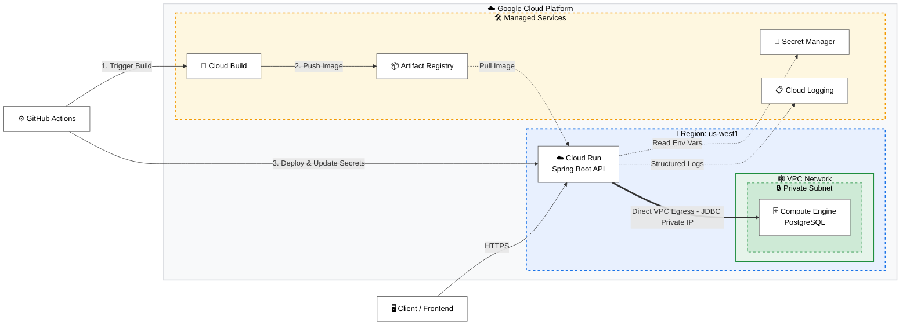
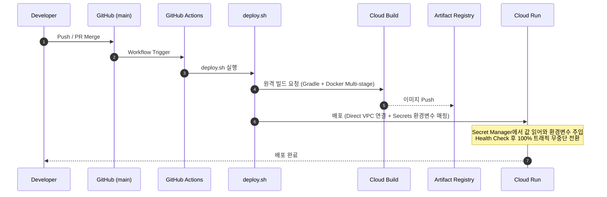

# 🌐 Every-Club-BE: Deployment & Architecture Guide

`every-club-be` 프로젝트의 인프라 설계와 CI/CD 파이프라인 구축 과정을 담은 가이드입니다. 
GCP 프리티어를 최대한 활용하면서도 **강화된 보안(Secret Manager, Private IP)**과 **가시성(Cloud Logging Severity)**을 확보한 무중단 자동 배포 환경을 실현합니다.

---

## 목차

1. [시스템 아키텍처](#1-시스템-아키텍처)
2. [GCP 인프라 셋업](#2-gcp-인프라-셋업)
3. [CI/CD 파이프라인](#3-cicd-파이프라인)
4. [GitHub Actions 구성](#4-github-actions-구성)
5. [유지보수 및 운영](#5-유지보수-및-운영)

---

## 1. 시스템 아키텍처

전체 서비스는 GCP `us-west1` 리전 내에서 운영되며, 데이터베이스는 외부 접근이 차단된 Private Subnet 환경에서 안전하게 관리됩니다.



### 핵심 인프라 결정 사항

| 구성 요소 | 선택 | 스펙 | 설계 목적 |
|---|---|---|---|
| API Server | Cloud Run | 0.25 vCPU / 512Mi | Scale to Zero를 통한 무과금 달성 |
| Database | GCE + PostgreSQL | e2-micro | Always Free Tier 내에서 직접 DB 운영 |
| Secrets | **Secret Manager** | — | 평문 노출 방지 및 런타임 환경변수 동적 주입 |
| Network | **Direct VPC Egress** | — | Cloud Run ↔ DB 통신 시 Public IP 없는 내부망 사용 |
| Logging | **Cloud Logging** | — | 어댑터 연동으로 Info/Warn/Error 등 정확한 로그 레벨(Severity) 수집 |
| Build | Cloud Build + Artifact | — | 서버리스 컨테이너 빌드 및 이미지 관리 |

**설계/보안 강화 포인트:**
- **Secret Manager 도입**: DB 비밀번호 등 민감정보를 평문으로 노출하지 않고 배포 시 `--update-secrets` 옵션으로 주입합니다. 애플리케이션에서는 기존처럼 환경변수로 읽어들입니다.
- **Direct VPC Egress**: Cloud Run에서 별도의 커넥터 없이 VPC 내부 대역으로 직접 통신(Private IP)하여 DB가 불필요하게 외부 인터넷에 노출되지 않도록 차단했습니다.
- **Logback 어댑터**: 모든 로그가 `default`로 뭉개지던 문제를 해결하여 오류 탐지와 모니터링 가시성을 높였습니다.

---

## 2. GCP 인프라 셋업

> 이 섹션은 GCP 콘솔에서 **최초 1회** 수행하는 작업입니다.

### 2-1. 프로젝트 생성 및 API 활성화

```bash
# 필수 API 활성화 (Secret Manager 추가됨)
gcloud services enable \
  run.googleapis.com \
  cloudbuild.googleapis.com \
  artifactregistry.googleapis.com \
  compute.googleapis.com \
  secretmanager.googleapis.com
```

### 2-2. Secret Manager 등록 및 권한 설정

앱 구동에 필요한 민감 정보들을 미리 등록합니다. (예: `DATABASE_PASSWORD`, `JWT_SECRET`)

```bash
# 시크릿 생성 예시
echo -n "<YOUR_DB_PASSWORD>" | gcloud secrets create DATABASE_PASSWORD --data-file=-
```

**런타임 서비스 계정 권한 부여**  
Cloud Run 전용 서비스 계정(예: `cloud-run-runtime@...`)이 시크릿을 읽어올 수 있도록 `Secret Accessor` 역할을 부여합니다.

```bash
RUNTIME_SA="<YOUR_RUNTIME_SA_EMAIL>"

gcloud projects add-iam-policy-binding <PROJECT_ID> \
  --member="serviceAccount:${RUNTIME_SA}" \
  --role="roles/secretmanager.secretAccessor"
```

### 2-3. Compute Engine — PostgreSQL 서버 구축 (Private IP)

DB 인스턴스를 e2-micro로 생성합니다. 이번 구조부터는 외부 접속(Public IP)이 아닌 내부망 접속을 권장합니다.

```bash
gcloud compute instances create every-club-db \
  --zone=us-west1-b \
  --machine-type=e2-micro \
  --image-family=ubuntu-2204-lts \
  --image-project=ubuntu-os-cloud \
  --boot-disk-size=30GB \
  --tags=postgres-server
```

#### 방화벽 규칙 제한 (보안)
기존의 `0.0.0.0/0` 개방 방식 대신, VPC 내부 서브넷 범위(또는 Cloud Run이 할당받는 대역)에서만 5432 포트 인바운드를 허용하도록 구성하여 외부 해킹 위협을 차단합니다.

### 2-4. Cloud Run 서비스 설정 (Direct VPC Egress)
배포 시 **Direct VPC Egress** 설정을 통해 VPC 네트워크로 아웃바운드 트래픽을 라우팅합니다. 이를 통해 GCE 내부 IP로 다이렉트 통신이 가능해집니다.

---

## 3. CI/CD 파이프라인

`main` 브랜치에 코드가 병합되면 아래 과정이 자동으로 수행됩니다.



**단계별 요약:**
1. **Build**: `deploy.sh`가 Cloud Build를 호출하여 소스 코드 빌드 및 Docker 이미지를 생성합니다.
2. **Deploy**: Cloud Run에 최신 이미지를 배포합니다. 이때 `gcloud run deploy --update-secrets` 옵션을 사용하여 Secret Manager의 최신 버전을 컨테이너 환경변수에 안전하게 바인딩합니다.
3. **Rollout**: 무중단 배포를 통해 서비스 중단 없이 신규 버전으로 전환합니다.

---

## 4. GitHub Actions 구성

### 4-1. GitHub Secrets 등록

비밀번호 등의 민감정보는 Secret Manager로 이관되었으므로, GitHub Secrets에는 최소한의 **배포 관련 인증 정보**만 보관합니다.

| Secret Name      | 용도 |
| ---------------- | ----------------------------------- |
| `GCP_PROJECT_ID` | GCP 프로젝트 ID |
| `GCP_SA_KEY`     | 배포용 서비스 계정 JSON 키 (운영/빌드 권한용) |
| 기타 환경변수    | `DATABASE_USERNAME`, `SMTP_HOST` 등 민감도가 상대적으로 낮은 일반 설정 (필요 시) |

---

## 5. 유지보수 및 운영

### 모니터링 — Cloud Logging (Severity 지원)
Logback 기반 로깅 어댑터를 통해 INFO, WARN, ERROR 등 로그 레벨(Severity)이 식별됩니다. GCP 로그 탐색기(Log Explorer)에서 `severity>=ERROR` 조건으로 검색하여 실제 애플리케이션의 버그 트래킹과 이슈 파악이 매우 수월해집니다.

### IAP(Identity-Aware Proxy)를 통한 안전한 DB 접근
DB의 Public IP 외부 접근이 차단되었으므로 로컬 환경에서 DB에 직접 접속해야 할 경우 다음과 같이 IAP TCP 터널링을 이용합니다.
```bash
gcloud compute ssh every-club-db \
    --zone=us-west1-b \
    --tunnel-through-iap \
    --project=<PROJECT_ID> \
    -- -L 5432:localhost:5432
```
(명령어 실행 후 로컬 `localhost:5432`로 DB 도구 접속 가능)

### 이미지 정리 정책
빌드가 누적되면 Artifact Registry 스토리지 요금이 발생할 수 있으므로, 자동 삭제 정책을 걸어 최신 N개의 이미지만 남기고 정리하도록 유지하는 것을 권장합니다.
