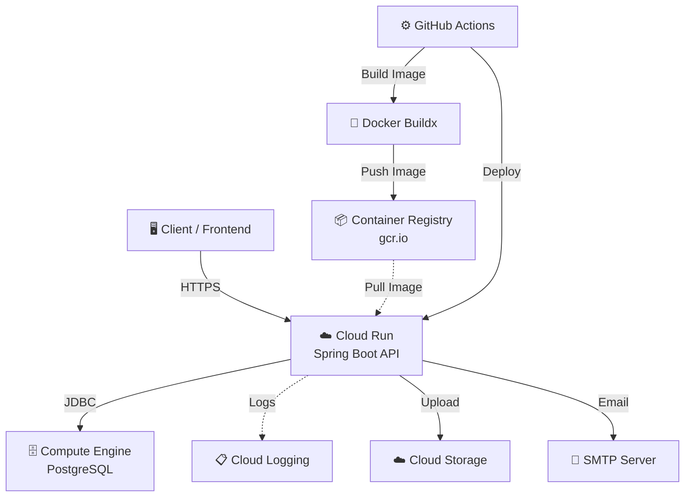
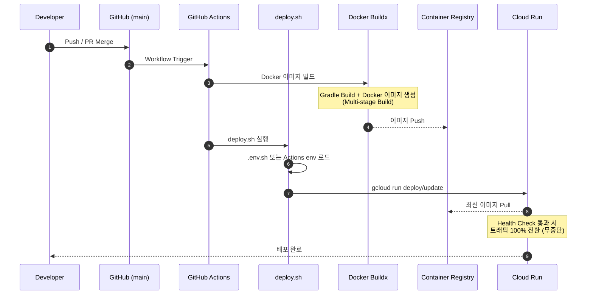

# 🌐 Every-Club-BE: Deployment & Architecture Guide

`every-club-be` 프로젝트의 인프라 설계와 CI/CD 파이프라인 구축 과정을 담은
가이드입니다. GCP 프리티어를 최대한 활용하여 **운용 비용 0원**을 달성하면서도,
GitHub Actions를 통한 **완전 자동 배포**를 실현합니다.

---

## 목차

1. [시스템 아키텍처](#1-시스템-아키텍처)
2. [GCP 인프라 셋업](#2-gcp-인프라-셋업)
3. [CI/CD 파이프라인](#3-cicd-파이프라인)
4. [GitHub Actions 구성](#4-github-actions-구성)
5. [유지보수 및 운영](#5-유지보수-및-운영)

---

## 1. 시스템 아키텍처

전체 서비스는 GCP `us-west1` 리전에서 운영됩니다.



### 핵심 인프라 결정 사항

| 구성 요소 | 선택 | 스펙 | 비용 전략 |
|---|---|---|---|
| API Server | Cloud Run | 0.25 vCPU / 512Mi | Scale to Zero → 무과금 |
| Database | Compute Engine + PostgreSQL | e2-micro | Always Free Tier |
| Image Registry | Container Registry (`gcr.io`) | — | GitHub Actions에서 이미지 push |
| Build | Docker Buildx (GitHub Actions) | linux/amd64 | GitHub Actions 캐시 활용 |
| Secrets | GitHub Secrets/Variables + Secret Manager | — | 민감도에 따라 분리 관리 |
| Storage | Cloud Storage (S3 호환) | — | 프리티어 범위 내 운용 |

**왜 이렇게 구성했는가:**

- **Cloud Run**: `Scale to Zero` 덕분에 트래픽이 0이면 과금도 0입니다. 트래픽
  급증 시에는 vCPU 밀리초 단위 과금으로 유연하게 대응합니다.
- **GCE 위 PostgreSQL**: Cloud SQL은 월 수만원이 기본입니다. e2-micro에 직접
  PostgreSQL을 올리면 Always Free Tier로 고정 비용이 0원입니다.
- **Secret 분리**: GitHub Actions에는 배포에 필요한 값을 주입하되, 비밀번호와
  토큰처럼 credential 성격이 강한 값은 GitHub Secrets 또는 Secret Manager에
  두고, 프로젝트 ID·호스트·포트·버킷명처럼 노출 위험이 낮은 설정값은 GitHub
  Variables로 관리합니다.

---

## 2. GCP 인프라 셋업

> 이 섹션은 GCP 콘솔에서 **최초 1회** 수행하는 작업입니다.

### 2-1. 프로젝트 생성 및 API 활성화

```bash
# 프로젝트 생성
gcloud projects create everyclub --name="Every Club"
gcloud config set project everyclub

# 필수 API 활성화
gcloud services enable \
  run.googleapis.com \
  artifactregistry.googleapis.com \
  compute.googleapis.com
```

### 2-2. 이미지 Registry

현재 GitHub Actions는 이미지를 `gcr.io/${PROJECT_ID}/every-club-be:${GITHUB_SHA}`로
push합니다. 워크플로우에서 `gcloud auth configure-docker gcr.io --quiet`로 Docker
인증을 설정한 뒤 `docker/build-push-action`이 이미지를 빌드하고 push합니다.

### 2-3. Compute Engine — PostgreSQL 서버 구축

#### 인스턴스 생성

```bash
gcloud compute instances create every-club-db \
  --zone=us-west1-b \
  --machine-type=e2-micro \
  --image-family=ubuntu-2204-lts \
  --image-project=ubuntu-os-cloud \
  --boot-disk-size=30GB \
  --tags=postgres-server
```

> 💡 `e2-micro` + 30GB 표준 디스크는 Always Free Tier 범위입니다.
> 리전은 `us-west1`, `us-central1`, `us-east1` 중 택 1.

<details>
<summary>방화벽 · PostgreSQL 설치 · 외부 접속 설정 상세</summary>

#### 방화벽 규칙 (PostgreSQL 접근 제한)

```bash
gcloud compute firewall-rules create allow-postgres-internal \
  --direction=INGRESS \
  --priority=1000 \
  --network=default \
  --action=ALLOW \
  --rules=tcp:5432 \
  --source-ranges=10.128.0.0/9 \
  --target-tags=postgres-server
```

> ⚠️ 운영 DB 포트는 공개 인터넷에 열지 않습니다. 현재 수동 정리로 public
> DB/HTTP/HTTPS 방화벽 규칙을 제거했고, DB 접근은 내부/VPC 기반 트래픽으로
> 제한하는 방향을 유지합니다. Cloud Run은 공개 HTTPS 서비스(`ingress: all`)로
> 두되, DB는 외부 IP가 아니라 내부 경로로 접근하도록 구성합니다.

#### PostgreSQL 설치 및 초기 설정

```bash
# GCE 인스턴스에 SSH 접속
gcloud compute ssh every-club-db --zone=us-west1-b

# PostgreSQL 설치
sudo apt update && sudo apt install -y postgresql postgresql-contrib

# DB 및 사용자 생성
sudo -u postgres psql <<EOF
CREATE USER everyclub WITH PASSWORD '<YOUR_STRONG_PASSWORD>';
CREATE DATABASE everyclub OWNER everyclub;
GRANT ALL PRIVILEGES ON DATABASE everyclub TO everyclub;
EOF
```

#### PostgreSQL 수신 설정

```bash
# postgresql.conf — 내부 네트워크 인터페이스에서 수신
sudo sed -i "s/#listen_addresses = 'localhost'/listen_addresses = '*'/" \
  /etc/postgresql/*/main/postgresql.conf

# pg_hba.conf — VPC 내부 대역에서만 비밀번호 인증 허용
echo "host all all 10.128.0.0/9 scram-sha-256" | \
  sudo tee -a /etc/postgresql/*/main/pg_hba.conf

# 적용
sudo systemctl restart postgresql
```

#### 접속 확인

```bash
# VPC 내부에서 GCE 내부 IP로 연결 테스트
psql -h <GCE_INTERNAL_IP> -U everyclub -d everyclub
```

> 💡 GCE는 SSH 운영을 위해 외부 IP를 유지하지만, PostgreSQL 접속용으로 공개하지
> 않습니다.

</details>

### 2-4. Cloud Run 서비스 생성

최초 배포 시 Cloud Run 서비스가 자동 생성되지만, 핵심 설정값을 명시합니다:

<details>
<summary>Cloud Run 설정값 상세</summary>

| 설정 | 값 | 설명 |
|---|---|---|
| CPU | 0.25 | 프리티어 최적화 |
| Memory | 512Mi | Spring Boot 최소 요구 |
| Max Instances | 1 | 과금 방지 |
| Container Concurrency | 1 | 요청 직렬 처리 |
| Startup CPU Boost | true | Cold Start 완화 |
| CPU Throttling | true | 요청 처리 시에만 CPU 할당 |
| Execution Environment | gen1 | 프리티어 호환 |
| Min Instances | 0 (Scale to Zero) | 무과금 핵심 |

</details>

### 2-5. GitHub Actions용 서비스 계정 생성

<details>
<summary>서비스 계정 생성 · IAM 역할 부여 · JSON 키 발급</summary>

```bash
# 서비스 계정 생성
gcloud iam service-accounts create github-actions-deployer \
  --display-name="GitHub Actions Deploy"

# 필요한 IAM 역할 부여
SA_EMAIL="github-actions-deployer@everyclub.iam.gserviceaccount.com"

gcloud projects add-iam-policy-binding everyclub \
  --member="serviceAccount:$SA_EMAIL" \
  --role="roles/run.admin"

gcloud projects add-iam-policy-binding everyclub \
  --member="serviceAccount:$SA_EMAIL" \
  --role="roles/iam.serviceAccountUser"

gcloud projects add-iam-policy-binding everyclub \
  --member="serviceAccount:$SA_EMAIL" \
  --role="roles/storage.admin"

gcloud projects add-iam-policy-binding everyclub \
  --member="serviceAccount:$SA_EMAIL" \
  --role="roles/cloudbuild.builds.builder"

# JSON 키 발급 (GitHub Secrets에 등록할 것)
gcloud iam service-accounts keys create gha-key.json \
  --iam-account=$SA_EMAIL
```

> ⚠️ `gha-key.json` 파일은 절대 Git에 커밋하지 마세요. GitHub Secrets에
> 등록한 뒤 로컬에서 삭제합니다.

</details>

---

## 3. CI/CD 파이프라인

`main` 브랜치에 코드가 병합되면 아래 과정이 자동으로 수행됩니다.



**단계별 요약:**

1. **Trigger** — `main` 브랜치에 push 또는 PR merge가 발생합니다.
2. **deploy.sh 실행** — GitHub Actions 워크플로우가
   [`.cloudrun/deploy.sh`](./.cloudrun/deploy.sh)를 호출합니다. 로컬 실행 시에는
   `.env.sh`를 source하고, GitHub Actions에서는 Secrets/Variables로 주입된 환경
   변수를 그대로 사용합니다.
3. **Build** — GitHub Actions의 `docker/build-push-action`이 linux/amd64 이미지를
   빌드하고 GitHub Actions 캐시를 사용합니다.
4. **Registry** — 완성된 이미지가 `gcr.io/${PROJECT_ID}/${SERVICE_NAME}:${GITHUB_SHA}`
   태그로 저장됩니다.
5. **Deploy** — `.cloudrun/deploy.sh`가 GitHub Actions에서 전달받은 `IMAGE`로
   Cloud Run을 배포하거나 업데이트합니다. 신규 서비스 생성 시에는 `DB_HOST`,
   `DB_USER`, `DB_PASS`, `DB_NAME`으로 `DATABASE_URL`을 조립해 함께 주입합니다.
6. **Rollout** — Cloud Run이 새 컨테이너의 Health Check 통과를 확인한 뒤
   트래픽을 100% 전환합니다 (무중단 배포).

---

## 4. GitHub Actions 구성

### 4-1. GitHub Secrets / Variables 등록

`Settings > Secrets and variables > Actions`에서 아래 변수를 등록합니다.

<details>
<summary>GitHub Secrets</summary>

| Secret Name | 설명 | 예시 |
|---|---|---|
| `GCP_SA_KEY` | 서비스 계정 JSON 키 (전체 내용) | `gha-key.json`의 내용 |
| `DB_USER` | DB 사용자 | `everyclub` |
| `DB_PASS` | DB 비밀번호 | — |
| `DB_NAME` | DB 이름 | `every-club` |
| `JWT_SECRET` | JWT 서명 키 | — |
| `SMTP_USERNAME` | SMTP 사용자 | — |
| `SMTP_PASSWORD` | SMTP 비밀번호 | — |
| `S3_ACCESS_KEY` | S3 액세스 키 | — |
| `S3_SECRET_KEY` | S3 시크릿 키 | — |

</details>

<details>
<summary>GitHub Variables</summary>

| Variable Name | 설명 | 예시 |
|---|---|---|
| `GCP_PROJECT_ID` | GCP 프로젝트 ID | `everyclub` |
| `DB_HOST` | DB 호스트 또는 내부 IP | `<GCE_INTERNAL_IP>` |
| `SMTP_HOST` | SMTP 서버 주소 | — |
| `SMTP_PORT` | SMTP 포트 | `465` 또는 `587` |
| `S3_ENDPOINT` | S3 호환 엔드포인트 | `https://storage.googleapis.com` |
| `S3_BUCKET` | S3 버킷 이름 | — |

</details>

<details>
<summary>Secret Manager</summary>

아래 값은 GCP Secret Manager에도 생성되어 있습니다. 애플리케이션에서 직접 참조하는
방식으로 전환할 경우 이 값을 사용합니다.

| Secret Name |
|---|
| `DATABASE_PASSWORD` |
| `JWT_SECRET` |
| `SMTP_PASSWORD` |
| `S3_SECRET_KEY` |

</details>

> 참고: GitHub Actions 로그에서 `***-be`처럼 서비스명이 일부 마스킹될 수 있습니다.
> secret 값에 `everyclub` 같은 문자열이 포함되어 있으면 GitHub가 안전을 위해 같은
> 문자열을 로그 전반에서 가립니다.

### 4-2. 핵심 설정 파일

레포지토리에 이미 존재하는 파일들입니다:

- **[`.cloudrun/deploy.sh`](./.cloudrun/deploy.sh)** — CI/CD의 핵심 실행 스크립트.
  GitHub Actions가 빌드/푸시한 이미지 태그를 받아 Cloud Run 배포 또는 업데이트를
  수행합니다.
- **[`.cloudrun/deploy_firsttime.sh`](./.cloudrun/deploy_firsttime.sh)** — 최초 생성용
  배포 스크립트. 모든 필수 환경 변수를 Cloud Run에 한 번에 주입합니다.
- **[`Dockerfile`](./Dockerfile)** — Multi-stage 빌드 정의. 빌드 이미지 크기를
  최소화합니다.
- **[`.github/workflows/deploy.yml`](.github/workflows/deploy.yml)** — GitHub
  Actions 워크플로우. push 이벤트 감지, Docker Buildx 이미지 빌드/푸시,
  `.cloudrun/deploy.sh` 호출을 오케스트레이션합니다.

---

## 5. 유지보수 및 운영

### 모니터링 — Cloud Logging

Cloud Run과 Cloud Logging이 자동 통합되어 있으므로, 애플리케이션의 `stdout`
(`log.info()` 등)이 별도 설정 없이 수집됩니다. 장애 시 GCP 콘솔 →
**Cloud Logging**에서 즉시 로그 분석이 가능합니다.

### 이미지 관리 — Container Registry

오래된 이미지가 쌓이면 저장소 비용이 발생합니다. 현재 이미지는 `gcr.io`로 push되므로
주기적으로 오래된 태그를 삭제하거나, Artifact Registry로 전환할 경우 cleanup policy를
설정해 최신 N개 이미지만 유지합니다.

### DB 백업 — GCE 스냅샷

Compute Engine의 **표준 스냅샷** 기능으로 디스크 전체를 백업할 수 있습니다.

```bash
# 수동 스냅샷 생성
gcloud compute disks snapshot every-club-db \
  --zone=us-west1-b \
  --snapshot-names=everyclub-db-$(date +%Y%m%d)
```

> 정기 백업이 필요하면 GCP 콘솔에서 **스냅샷 일정(Snapshot Schedule)**을
> 설정하세요.

### IP 변동 대응

GCE 프리티어의 임시 공용 IP는 인스턴스 재시작 시 변경될 수 있습니다. SSH 운영을
위해 외부 IP는 유지하되, DB 접근은 내부/VPC 기반 트래픽으로 제한합니다. DB 호스트가
바뀐 경우에는 `DB_HOST` 값을 갱신하고 Cloud Run 환경 변수를 다시 반영해야 합니다.

- **DDNS**: 인스턴스 시작 스크립트에서 DNS 레코드를 자동 업데이트
- **Cloudflare Tunnel**: 공용 IP 없이도 안전한 터널링 가능
- **Cloud Run 환경 변수 갱신**: IP/DB명이 바뀌면 `DB_HOST` 또는 `DB_NAME`을
  갱신하고 재배포

### Cloud Run 환경 변수 갱신 주의

현재 배포 스크립트는 Cloud Run 서비스가 이미 존재하는 경우 `SPRING_PROFILES_ACTIVE`
만 업데이트하는 흐름으로 확인되었습니다. DB, SMTP, S3 등 다른 환경 변수를 바꿨다면
배포 로그와 Cloud Run 서비스 설정을 확인하고, 필요 시 `gcloud run services update`
또는 신규 revision 배포로 환경 변수를 명시적으로 갱신합니다.

---

## 부록: 환경 변수 목록

<details>
<summary>Cloud Run 컨테이너에 주입되는 전체 환경 변수</summary>

| 변수명 | 용도 |
|---|---|
| `SPRING_PROFILES_ACTIVE` | Spring 프로파일 (`prod`) |
| `DB_HOST` | 배포 스크립트 입력값: PostgreSQL 호스트 |
| `DB_USER` | 배포 스크립트 입력값: DB 사용자명 |
| `DB_PASS` | 배포 스크립트 입력값: DB 비밀번호 |
| `DB_NAME` | 배포 스크립트 입력값: DB 이름 |
| `DATABASE_URL` | Cloud Run 주입값: `DB_HOST`와 `DB_NAME`으로 조립한 PostgreSQL JDBC URL |
| `DATABASE_USERNAME` | Cloud Run 주입값: `DB_USER` |
| `DATABASE_PASSWORD` | Cloud Run 주입값: `DB_PASS` |
| `JWT_SECRET` | JWT 토큰 서명 키 |
| `SMTP_HOST` | 이메일 발송 서버 |
| `SMTP_PORT` | SMTP 포트 (기본 `465`) |
| `SMTP_USERNAME` | SMTP 인증 사용자 |
| `SMTP_PASSWORD` | SMTP 인증 비밀번호 |
| `S3_ENDPOINT` | S3 호환 스토리지 엔드포인트 |
| `S3_ACCESS_KEY` | S3 액세스 키 |
| `S3_SECRET_KEY` | S3 시크릿 키 |
| `S3_BUCKET` | S3 버킷 이름 |

</details>
