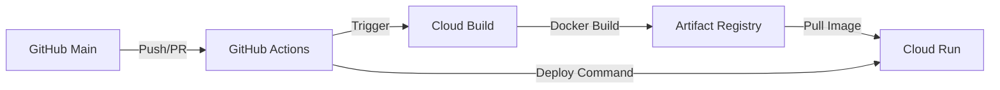

# 🌐 Every-Club-BE: Cloud Native Deployment Guide

이 문서는 `every-club-be` 프로젝트의 인프라 설계와 GitHub Actions + GCP를 이용한 CI/CD 파이프라인 구축 과정을 담고 있습니다.

## 1. 🏗 아키텍처 개요 (Architecture)

본 프로젝트는 '운용 비용 0원'과 '완전 자동화'를 목표로 설계되었습니다.

### 핵심 전략

- Serverless (Cloud Run): 트래픽이 없을 때는 비용이 발생하지 않는 `Scale to Zero` 전략 채택.
- Always Free Tier (GCE): PostgreSQL DB를 GCP의 무료 인스턴스(`e2-micro`)에 구축하여 고정 비용 제거.
- Remote Build (Cloud Build): 로컬 환경의 의존성 없이 GCP 환경 위에서 일관된 이미지 빌드 수행, Artifact Registry와의 유연한 통합.

---

## 2. 🚀 CI/CD 파이프라인 (Deployment Workflow)

메인 브랜치에 코드가 병합되면, 아래의 과정이 자동으로 수행됩니다.

1.  Trigger: GitHub `main` 브랜치에 코드가 유입됩니다.
2.  Build: GitHub Actions가 GCP Cloud Build를 트리거하여 컨테이너 이미지를 생성합니다.
3.  Registry: 생성된 이미지는 Artifact Registry에 버전별로 저장됩니다.
4.  Deploy: 빌드 완료 후 GitHub Actions가 Cloud Run에 최신 이미지로의 교체를 명령합니다. (무중단 배포)

---

## 3. 🛠 사전 준비 사항 (Prerequisites)

배포를 시작하기 전, 다음 세 가지 설정이 완료되어야 합니다.

### GCP 환경 설정

- API 활성화: Cloud Run, Cloud Build, Artifact Registry API를 사용 설정해야 합니다.
- IAM 권한: GitHub Actions용 서비스 계정에 다음 권한이 필요합니다.
  - `Cloud Build 편집자`
  - `Cloud Run 관리자`
  - `저장소 관리자` (Artifact Registry 접근용)

### GitHub Secrets 설정

프로젝트의 `Settings > Secrets and variables > Actions`에 보안 변수를 등록합니다.

- `GCP_PROJECT_ID`: GCP 프로젝트 ID
- `GCP_SA_KEY`: 서비스 계정 JSON 키
- `DB_URL` / `DB_PASSWORD`: 데이터베이스 접속 정보 (Spring Boot 환경변수용)
- 등등...

### 핵심 설정 파일 (Repository 내 위치)

- `Dockerfile`: 컨테이너 빌드 정의 ([파일 보기](./Dockerfile))
- `cloudbuild.yaml`: GCP 빌드 단계 정의 ([파일 보기](./cloudbuild.yaml))
- `.github/workflows/deploy.yml`: 전체 자동화 워크플로우 ([파일 보기](.github/workflows/deploy.yml))

---

## 4. 📝 배포 프로세스 상세 (Step-by-Step)

### Step 1: 소스 코드 반영

로컬에서 개발 후 `main` 브랜치로 `git push`를 수행합니다.

### Step 2: 자동 빌드 및 배포 감시

GitHub의 Actions 탭에서 배포가 진행되는 과정을 실시간으로 확인합니다.

- Cloud Build 단계에서 Gradle 빌드 및 Docker 레이어 생성이 수행됩니다.
- 빌드 이미지 크기 축소를 위해 Multi-stage build를 사용하였습니다.

### Step 3: 환경 변수 주입

Cloud Run 배포 시, 시크릿 변수들이 환경 변수를 통해 컨테이너 런타임에 주입됩니다. 이는 보안상 매우 안전하며 설정 관리가 용이합니다.

## 5. 🛠 유지보수 및 운영 (Ops)

### 모니터링 (Cloud Logging)

애플리케이션의 `System.out`이나 `log.info()`는 자동으로 Cloud Logging에 수집됩니다. 서버 장애 시 GCP 콘솔에서 즉시 로그 분석이 가능합니다.

### 이미지 관리 (Cleanup Policy)

Artifact Registry에 쌓이는 오래된 이미지는 비용 발생의 원인이 됩니다. 본 프로젝트는 최신 이미지 외 자동 삭제 정책을 설정하여 스토리지를 효율적으로 관리합니다.

