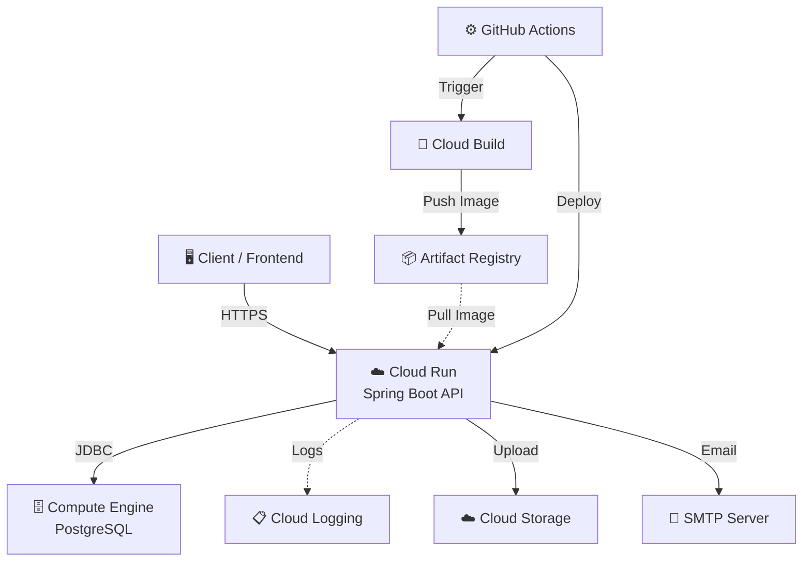
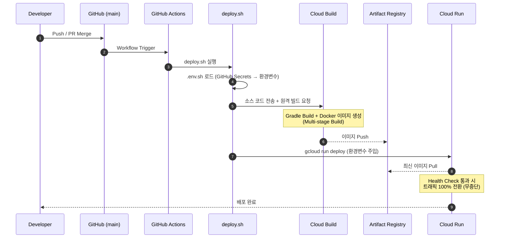
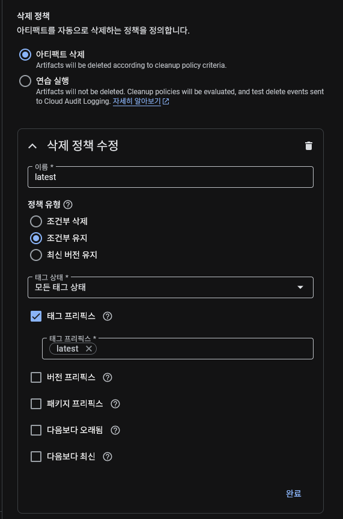

# 🌐 Every-Club-BE: Deployment & Architecture Guide

`every-club-be` 프로젝트의 인프라 설계와 CI/CD 파이프라인 구축 과정을 담은
가이드입니다. GCP 프리티어를 최대한 활용하여 **운용 비용 0원**을 달성하면서도,
GitHub Actions를 통한 **완전 자동 배포**를 실현합니다.

---

## 목차

1. [시스템 아키텍처](#1-시스템-아키텍처)
2. [GCP 인프라 셋업](#2-gcp-인프라-셋업)
3. [CI/CD 파이프라인](#3-cicd-파이프라인)
4. [GitHub Actions 구성](#4-github-actions-구성)
5. [유지보수 및 운영](#5-유지보수-및-운영)

---

## 1. 시스템 아키텍처

전체 서비스는 GCP `us-west1` 리전에서 운영됩니다.



### 핵심 인프라 결정 사항

| 구성 요소      | 선택                        | 스펙              | 비용 전략                           |
| -------------- | --------------------------- | ----------------- | ----------------------------------- |
| API Server     | Cloud Run                   | 0.25 vCPU / 512Mi | Scale to Zero → 무과금              |
| Database       | Compute Engine + PostgreSQL | e2-micro          | Always Free Tier                    |
| Image Registry | Artifact Registry           | —                 | 자동 삭제 정책으로 저장소 비용 관리 |
| Build          | Cloud Build                 | —                 | 일 120분 무료 빌드                  |
| Secrets        | `.env.sh` + GitHub Secrets  | —                 | Secret Manager 비용 회피            |
| Storage        | Cloud Storage (S3 호환)     | —                 | 프리티어 범위 내 운용               |

**왜 이렇게 구성했는가:**

- **Cloud Run**: `Scale to Zero` 덕분에 트래픽이 0이면 과금도 0입니다. 트래픽
  급증 시에는 vCPU 밀리초 단위 과금으로 유연하게 대응합니다.
- **GCE 위 PostgreSQL**: Cloud SQL은 월 수만원이 기본입니다. e2-micro에 직접
  PostgreSQL을 올리면 Always Free Tier로 고정 비용이 0원입니다.
- **Secret Manager 미사용**: 호출당 과금이 발생하므로 기각. 환경 변수 방식이
  비용 절감과 타 플랫폼 마이그레이션에도 유리합니다.

---

## 2. GCP 인프라 셋업

> 이 섹션은 GCP 콘솔에서 **최초 1회** 수행하는 작업입니다.

### 2-1. 프로젝트 생성 및 API 활성화

```bash
# 프로젝트 생성
gcloud projects create everyclub --name="Every Club"
gcloud config set project everyclub

# 필수 API 활성화
gcloud services enable \
  run.googleapis.com \
  cloudbuild.googleapis.com \
  artifactregistry.googleapis.com \
  compute.googleapis.com
```

### 2-2. Artifact Registry 저장소 생성

```bash
gcloud artifacts repositories create every-club-repo \
  --repository-format=docker \
  --location=us-west1 \
  --description="Every Club Docker images"
```

### 2-3. Compute Engine — PostgreSQL 서버 구축

#### 인스턴스 생성

```bash
gcloud compute instances create every-club-db \
  --zone=us-west1-b \
  --machine-type=e2-micro \
  --image-family=ubuntu-2204-lts \
  --image-project=ubuntu-os-cloud \
  --boot-disk-size=30GB \
  --tags=postgres-server
```

> 💡 `e2-micro` + 30GB 표준 디스크는 Always Free Tier 범위입니다.
> 리전은 `us-west1`, `us-central1`, `us-east1` 중 택 1.

<details>
<summary>방화벽 · PostgreSQL 설치 · 외부 접속 설정 상세</summary>

#### 방화벽 규칙 (PostgreSQL 포트 개방)

```bash
gcloud compute firewall-rules create allow-postgres \
  --direction=INGRESS \
  --priority=1000 \
  --network=default \
  --action=ALLOW \
  --rules=tcp:5432 \
  --source-ranges=0.0.0.0/0 \
  --target-tags=postgres-server
```

> ⚠️ `source-ranges`를 `0.0.0.0/0`으로 열면 전 세계에서 접근 가능합니다.
> 프로덕션에서는 Cloud Run의 이그레스 IP만 허용하거나, VPC Connector를 사용하는
> 것이 안전합니다. 프리티어 프로젝트이므로 PostgreSQL의 `pg_hba.conf`와
> 강력한 비밀번호로 보완합니다.

#### PostgreSQL 설치 및 초기 설정

```bash
# GCE 인스턴스에 SSH 접속
gcloud compute ssh every-club-db --zone=us-west1-b

# PostgreSQL 설치
sudo apt update && sudo apt install -y postgresql postgresql-contrib

# DB 및 사용자 생성
sudo -u postgres psql <<EOF
CREATE USER everyclub WITH PASSWORD '<YOUR_STRONG_PASSWORD>';
CREATE DATABASE everyclub OWNER everyclub;
GRANT ALL PRIVILEGES ON DATABASE everyclub TO everyclub;
EOF
```

#### 외부 접속 허용 설정

```bash
# postgresql.conf — 모든 인터페이스에서 수신
sudo sed -i "s/#listen_addresses = 'localhost'/listen_addresses = '*'/" \
  /etc/postgresql/*/main/postgresql.conf

# pg_hba.conf — 비밀번호 인증으로 외부 접속 허용
echo "host all all 0.0.0.0/0 scram-sha-256" | \
  sudo tee -a /etc/postgresql/*/main/pg_hba.conf

# 적용
sudo systemctl restart postgresql
```

#### 접속 확인

```bash
# 로컬에서 GCE 외부 IP로 연결 테스트
psql -h <GCE_EXTERNAL_IP> -U everyclub -d everyclub
```

> 💡 GCE의 임시 공용 IP는 인스턴스 재시작 시 변경될 수 있습니다. DDNS나
> Cloudflare Tunnel을 통해 안정적인 접근점을 확보할 수 있습니다.

</details>

### 2-4. Cloud Run 서비스 생성

최초 배포 시 Cloud Run 서비스가 자동 생성되지만, 핵심 설정값을 명시합니다:

<details>
<summary>Cloud Run 설정값 상세</summary>

| 설정                  | 값                | 설명                      |
| --------------------- | ----------------- | ------------------------- |
| CPU                   | 0.25              | 프리티어 최적화           |
| Memory                | 512Mi             | Spring Boot 최소 요구     |
| Max Instances         | 1                 | 과금 방지                 |
| Container Concurrency | 1                 | 요청 직렬 처리            |
| Startup CPU Boost     | true              | Cold Start 완화           |
| CPU Throttling        | true              | 요청 처리 시에만 CPU 할당 |
| Execution Environment | gen1              | 프리티어 호환             |
| Min Instances         | 0 (Scale to Zero) | 무과금 핵심               |

</details>

### 2-5. GitHub Actions용 서비스 계정 생성

<details>
<summary>서비스 계정 생성 · IAM 역할 부여 · JSON 키 발급</summary>

```bash
# 서비스 계정 생성
gcloud iam service-accounts create github-actions \
  --display-name="GitHub Actions Deploy"

# 필요한 IAM 역할 부여
SA_EMAIL="github-actions@everyclub.iam.gserviceaccount.com"

gcloud projects add-iam-policy-binding everyclub \
  --member="serviceAccount:$SA_EMAIL" \
  --role="roles/cloudbuild.builds.editor"

gcloud projects add-iam-policy-binding everyclub \
  --member="serviceAccount:$SA_EMAIL" \
  --role="roles/run.admin"

gcloud projects add-iam-policy-binding everyclub \
  --member="serviceAccount:$SA_EMAIL" \
  --role="roles/artifactregistry.admin"

gcloud projects add-iam-policy-binding everyclub \
  --member="serviceAccount:$SA_EMAIL" \
  --role="roles/iam.serviceAccountUser"

# JSON 키 발급 (GitHub Secrets에 등록할 것)
gcloud iam service-accounts keys create gha-key.json \
  --iam-account=$SA_EMAIL
```

> ⚠️ `gha-key.json` 파일은 절대 Git에 커밋하지 마세요. GitHub Secrets에
> 등록한 뒤 로컬에서 삭제합니다.

</details>

---

## 3. CI/CD 파이프라인

`main` 브랜치에 코드가 병합되면 아래 과정이 자동으로 수행됩니다.



**단계별 요약:**

1. **Trigger** — `main` 브랜치에 push 또는 PR merge가 발생합니다.
2. **deploy.sh 실행** — GitHub Actions 워크플로우가
   [`deploy.sh`](./deploy.sh)를 호출합니다. 스크립트는 먼저 GitHub Secrets에서
   주입된 환경 변수(`.env.sh` 형태)를 로드합니다.
3. **Build** — `deploy.sh`가 Cloud Build에 소스 코드를 전송합니다. Gradle 빌드와
   Multi-stage Docker 빌드가 GCP 서버 위에서 실행되므로 로컬 Docker가
   불필요합니다.
4. **Registry** — 완성된 이미지가 Artifact Registry에 버전별로 저장됩니다.
5. **Deploy** — `deploy.sh`가 `gcloud run deploy --set-env-vars` 명령으로
   Cloud Run에 최신 이미지를 배포하면서 환경 변수를 주입합니다.
6. **Rollout** — Cloud Run이 새 컨테이너의 Health Check 통과를 확인한 뒤
   트래픽을 100% 전환합니다 (무중단 배포).

---

## 4. GitHub Actions 구성

### 4-1. GitHub Secrets 등록

`Settings > Secrets and variables > Actions`에서 아래 변수를 등록합니다.

<details>
<summary>전체 Secret 목록</summary>

| Secret Name         | 설명                            | 예시                                    |
| ------------------- | ------------------------------- | --------------------------------------- |
| `GCP_PROJECT_ID`    | GCP 프로젝트 ID                 | `everyclub`                             |
| `GCP_SA_KEY`        | 서비스 계정 JSON 키 (전체 내용) | `gha-key.json`의 내용                   |
| `DATABASE_URL`      | DB JDBC URL                     | `jdbc:postgresql://<IP>:5432/everyclub` |
| `DATABASE_USERNAME` | DB 사용자                       | `everyclub`                             |
| `DATABASE_PASSWORD` | DB 비밀번호                     | —                                       |
| `JWT_SECRET`        | JWT 서명 키                     | —                                       |
| `SMTP_HOST`         | SMTP 서버 주소                  | —                                       |
| `SMTP_PORT`         | SMTP 포트                       | `465`                                   |
| `SMTP_USERNAME`     | SMTP 사용자                     | —                                       |
| `SMTP_PASSWORD`     | SMTP 비밀번호                   | —                                       |
| `S3_ENDPOINT`       | S3 호환 엔드포인트              | —                                       |
| `S3_ACCESS_KEY`     | S3 액세스 키                    | —                                       |
| `S3_SECRET_KEY`     | S3 시크릿 키                    | —                                       |
| `S3_BUCKET`         | S3 버킷 이름                    | —                                       |

</details>

### 4-2. 핵심 설정 파일

레포지토리에 이미 존재하는 파일들입니다:

- **[`deploy.sh`](./deploy.sh)** — CI/CD의 핵심 실행 스크립트. 환경 변수 로드 →
  Cloud Build 트리거 → Cloud Run 배포까지 일괄 수행합니다. GitHub Actions
  워크플로우에서 호출됩니다.
- **[`Dockerfile`](./Dockerfile)** — Multi-stage 빌드 정의. 빌드 이미지 크기를
  최소화합니다.
- **[`cloudbuild.yaml`](./cloudbuild.yaml)** — GCP Cloud Build 단계를 정의합니다.
- **[`.github/workflows/deploy.yml`](.github/workflows/deploy.yml)** — GitHub
  Actions 워크플로우. push 이벤트 감지 → `deploy.sh` 호출을 오케스트레이션합니다.

---

## 5. 유지보수 및 운영

### 모니터링 — Cloud Logging

Cloud Run과 Cloud Logging이 자동 통합되어 있으므로, 애플리케이션의 `stdout`
(`log.info()` 등)이 별도 설정 없이 수집됩니다. 장애 시 GCP 콘솔 →
**Cloud Logging**에서 즉시 로그 분석이 가능합니다.

### 이미지 관리 — Artifact Registry Cleanup Policy

오래된 이미지가 쌓이면 저장소 비용이 발생합니다. Artifact Registry 콘솔에서
**자동 삭제 정책**을 설정하여 최신 N개 이미지만 유지하도록 구성합니다.



### DB 백업 — GCE 스냅샷

Compute Engine의 **표준 스냅샷** 기능으로 디스크 전체를 백업할 수 있습니다.

```bash
# 수동 스냅샷 생성
gcloud compute disks snapshot every-club-db \
  --zone=us-west1-b \
  --snapshot-names=everyclub-db-$(date +%Y%m%d)
```

> 정기 백업이 필요하면 GCP 콘솔에서 **스냅샷 일정(Snapshot Schedule)**을
> 설정하세요.

### IP 변동 대응

GCE 프리티어의 임시 공용 IP는 인스턴스 재시작 시 변경될 수 있습니다. 대응
방법:

- **DDNS**: 인스턴스 시작 스크립트에서 DNS 레코드를 자동 업데이트
- **Cloudflare Tunnel**: 공용 IP 없이도 안전한 터널링 가능
- **Cloud Run 환경 변수 갱신**: IP 변경 시 `DATABASE_URL` Secret을 업데이트하고
  재배포

---

## 부록: 환경 변수 목록

<details>
<summary>Cloud Run 컨테이너에 주입되는 전체 환경 변수</summary>

| 변수명                   | 용도                        |
| ------------------------ | --------------------------- |
| `SPRING_PROFILES_ACTIVE` | Spring 프로파일 (`prod`)    |
| `DATABASE_URL`           | PostgreSQL JDBC URL         |
| `DATABASE_USERNAME`      | DB 사용자명                 |
| `DATABASE_PASSWORD`      | DB 비밀번호                 |
| `JWT_SECRET`             | JWT 토큰 서명 키            |
| `SMTP_HOST`              | 이메일 발송 서버            |
| `SMTP_PORT`              | SMTP 포트 (기본 `465`)      |
| `SMTP_USERNAME`          | SMTP 인증 사용자            |
| `SMTP_PASSWORD`          | SMTP 인증 비밀번호          |
| `S3_ENDPOINT`            | S3 호환 스토리지 엔드포인트 |
| `S3_ACCESS_KEY`          | S3 액세스 키                |
| `S3_SECRET_KEY`          | S3 시크릿 키                |
| `S3_BUCKET`              | S3 버킷 이름                |

</details>
