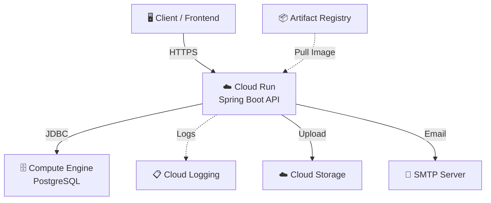
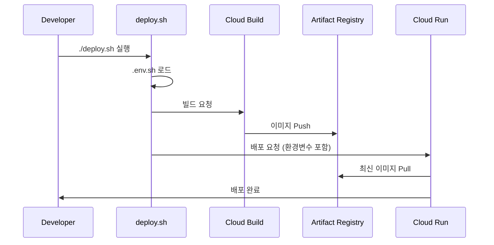

# 🌐 Every-Club-BE Deployment & Architecture

`every-club-be` 프로젝트의 인프라 설계와 배포 프로세스를 설명하는 가이드입니다.
GCP의 프리티어 정책을 최대한 활용하여 운용 비용 0원을 목표로 하면서도, 서비스
안정성을 확보할 수 있도록 서버리스(Cloud Run)와 IaaS(Compute Engine)를 혼합하여
설계했습니다.

---

## 🏗️ 1. 시스템 아키텍처 (System Architecture)

전체 서비스는 Google Cloud Platform(GCP) us-west1 리전에서 운영됩니다.



</details>

### ☁️ 주요 인프라 결정 사항

- Cloud Run (API Server)
  - 성능: 0.25 CPU / 512Mi Memory (프리티어 범위 내 최적화)
  - 비용 및 확장: `Scale to Zero` 설정을 통해 무과금 운영을 실현했으며, 트래픽
    급증 시 vCPU 밀리초 단위 청구 방식을 통해 유연하게 대응합니다.
  - 로깅: Cloud Logging과 통합되어 별도의 로깅 서버 없이도 컨테이너의 표준
    출력(stdout)을 통해 실시간 로그 확인 및 분석이 가능합니다.
- Compute Engine (PostgreSQL)
  - 스펙: `e2-micro` (Always Free Tier)
  - 접근 제어: 설정 간소화를 위해 공용 IP(Public IP)를 통해 데이터베이스에
    접근합니다. 무료 티어의 임시 공용 IP를 사용하므로 무료입니다. IP 변동 문제는
    DDNS나 Cloudflare Tunnel 등을 통해 해결할 수 있습니다.
  - 백업: 데이터 안정성을 위해 GCE 인스턴스 전체에 대한 표준 스냅샷(Snapshot)
    기능을 사용하여 수동/정기 백업 전략을 선택적으로 운용할 수 있습니다.
- Artifact Registry
  - 역할: 도커 이미지 저장소. 기존 GCR(Container Registry)을 대체하는 GCP의
    차세대 관리형 레지스트리를 사용합니다.
  - 특징: Cloud Build와 연동되어 배포 속도를 높이며, 불필요한 예전 빌드 이미지를
    자동 삭제하도록 설정하여 저장소 비용을 관리합니다.
- Environment Variables & Secrets
  - 관리 방식: `.env.sh` 스크립트를 통한 런타임 주입.
  - 결정 사유: GCP Secret Manager는 호출 및 유지 비용이 발생하므로 기각했습니다.
    대신 환경 변수 방식을 채택하여 비용 절감과 향후 타 플랫폼(AWS, On-premise
    등)으로의 마이그레이션 용이성을 확보했습니다.
- Cloud Storage (S3 Compatible)
  - GCP 내 스토리지 서비스를 활용하며, S3 호환 API를 통해 애플리케이션 코드 변경
    없이 유연한 데이터 환경을 구축했습니다.

---

## 🚀 2. 배포 파이프라인 (Deployment Workflow)



---

## 🛠️ 3. 배포 가이드 (How to Deploy)

> [!IMPORTANT]
> 본 가이드는 로컬 개발 환경에서의 직접 배포를 기준으로 작성되었습니다. Github
> Action 등의 [CI/CD 파이프라인](./.github/workflows/deploy.yml)을 통해 배포하는
> 것이 권장됩니다.

### 사전 요구사항

1. gcloud CLI: 설치 및 프로젝트 설정(`everyclub`) 완료.
2. 환경 변수 파일: `.env.sh` 경로에 DB 접속 정보 및 API 키 등이 정의되어 있어야
   합니다. (보안상 Git 관리 제외)
3. 다음 yml을 가진 Cloud Run 서비스가 이미 존재해야 합니다.
   <details>
    <summary>Cloud Run 서비스 yml</summary>
   ```yml
   apiVersion: serving.knative.dev/v1
   kind: Service
   metadata:
     name: every-club-be
     namespace: <PROJECT_NUMBER>
     selfLink: /apis/serving.knative.dev/v1/namespaces/<PROJECT_NUMBER>/services/every-club-be
     uid: <UID>
     resourceVersion: <RESOURCE_VERSION>
     generation: 16
     creationTimestamp: "2026-03-16T09:40:56.920881Z"
     labels:
       cloud.googleapis.com/location: us-west1
     annotations:
       serving.knative.dev/creator: <CREATOR_EMAIL>
       serving.knative.dev/lastModifier: <LAST_MODIFIER_EMAIL>
       run.googleapis.com/client-name: gcloud
       run.googleapis.com/client-version: 557.0.0
       run.googleapis.com/operation-id: <OPERATION_ID>
       run.googleapis.com/ingress: all
       run.googleapis.com/ingress-status: all
       run.googleapis.com/invoker-iam-disabled: "true"
       run.googleapis.com/maxScale: 1
       run.googleapis.com/urls: "[\"https://<SERVICE_URL_1>\",\"https://<SERVICE_URL_2>\"]"
   spec:
     template:
       metadata:
         labels:
           client.knative.dev/nonce: ttvhwyjsfb
           run.googleapis.com/startupProbeType: Custom
         annotations:
           autoscaling.knative.dev/maxScale: 1
           run.googleapis.com/client-name: gcloud
           run.googleapis.com/client-version: 557.0.0
           run.googleapis.com/execution-environment: gen1
           run.googleapis.com/cpu-throttling: "true"
           run.googleapis.com/startup-cpu-boost: "true"
       spec:
         containerConcurrency: 1
         timeoutSeconds: 300
         serviceAccountName: <SERVICE_ACCOUNT>
         containers:
           - name: every-club-be-1
             image: gcr.io/<PROJECT_ID>/<IMAGE_NAME>:<TAG>
             ports:
               - name: http1
                 containerPort: 8080
             env:
               - name: SPRING_PROFILES_ACTIVE
                 value: prod
               - name: DATABASE_URL
                 value: <YOUR_DATABASE_URL>
               - name: DATABASE_USERNAME
                 value: <YOUR_DATABASE_USERNAME>
               - name: DATABASE_PASSWORD
                 value: <YOUR_DATABASE_PASSWORD>
               - name: JWT_SECRET
                 value: <YOUR_JWT_SECRET>
               - name: SMTP_HOST
                 value: <YOUR_SMTP_HOST>
               - name: SMTP_PORT
                 value: 465
               - name: SMTP_USERNAME
                 value: <YOUR_SMTP_USERNAME>
               - name: SMTP_PASSWORD
                 value: <YOUR_SMTP_PASSWORD>
               - name: S3_ENDPOINT
                 value: <YOUR_S3_ENDPOINT>
               - name: S3_ACCESS_KEY
                 value: <YOUR_S3_ACCESS_KEY>
               - name: S3_SECRET_KEY
                 value: <YOUR_S3_SECRET_KEY>
               - name: S3_BUCKET
                 value: <YOUR_S3_BUCKET>
             resources:
               limits:
                 cpu: 0.25
                 memory: 512Mi
             startupProbe:
               initialDelaySeconds: 10
               timeoutSeconds: 240
               periodSeconds: 240
               failureThreshold: 1
               tcpSocket:
                 port: 8080
     traffic:
       - percent: 100
         latestRevision: true
   status:
     observedGeneration: 16
     conditions:
       - type: Ready
         status: "True"
         lastTransitionTime: "2026-03-20T14:11:18.273578Z"
       - type: ConfigurationsReady
         status: "True"
         lastTransitionTime: "2026-03-20T14:10:53.609953Z"
       - type: RoutesReady
         status: "True"
         lastTransitionTime: "2026-03-20T14:11:18.246812Z"
     latestReadyRevisionName: every-club-be-00014-fb8
     latestCreatedRevisionName: every-club-be-00014-fb8
     traffic:
       - revisionName: every-club-be-00014-fb8
         percent: 100
         latestRevision: true
     url: https://<SERVICE_URL>
     address:
       url: https://<SERVICE_URL>
   ```

</details>
4. Cloud Build와 Compute Engine API 활성화가 되어 있어야 합니다.

### 배포 실행

```bash
# 1. 실행 권한 부여
chmod +x deploy.sh

# 2. 배포 스크립트 실행
./deploy.sh
```

상세 프로세스:

1. 환경 변수 로드: `.env.sh`에 정의된 값을 읽어 배포 시
   `gcloud run deploy --set-env-vars` 옵션으로 주입합니다.
2. Cloud Build: 로컬의 Dockerfile을 기반으로 GCP 빌드 서버에서 이미지를
   생성하므로 로컬 Docker 설치 여부와 상관없이 배포 가능합니다.
3. Traffic Management: 새로운 버전의 컨테이너가 정상 구동(Health Check)되면 이전
   버전에서 신규 버전으로 트래픽을 100% 자동 전환합니다.
4. Monitoring: 배포 직후 GCP 콘솔의 Cloud Logging 메뉴를 통해 애플리케이션
   초기화 로그를 즉시 확인할 수 있습니다.

## 4. 기타 설정

### Artifact Registry


다음과 같이 설정하여 불필요한 이미지 삭제 정책을 설정할 수 있습니다.
